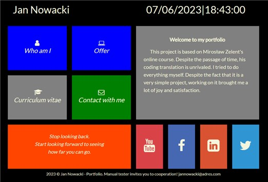

# sample-portfolio
##It is a project to consolidate knowledge in the field of the olline course and is based on it. 
I use HTML, CSS and JS technologies.
The project is under development.
 
<h3>Technologies</h3>
<ul>
    <li>HTML</li>
    <li>CSS</li>
    <li>JAVASCRIPT</li>
</ul>
 
<h3>Software required to run project:</h3>
<ul>
    <li>Visual Studio Code 2022</li>
</ul>
 

